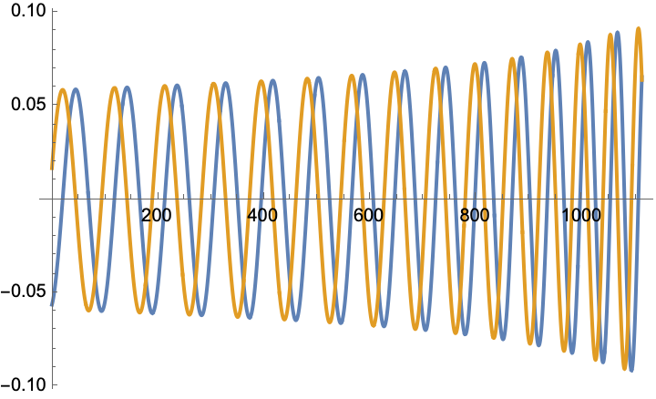
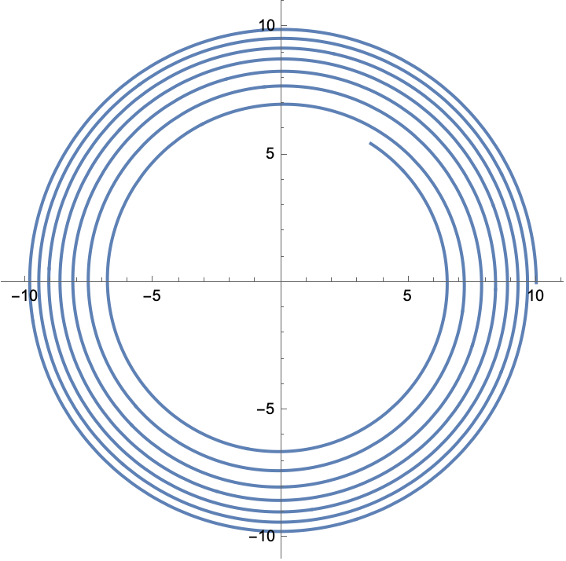



<p>
 <h1 style="display:inline">WaSABI</h1> <span style="float:right;"><a href="https://bhptoolkit.org/mathematica-install.html" class = "code_btn">Install this package!</a></span>
 <h2>Waveform Simulations of Asymmetric Binary Inspirals</h2>
</p>

A package to generate gravitational waveforms from SF theory and SF-PN Hybrids.

Currently 0PA and 1PAT1 quasicircular, non-spinning models are available. As an example, the gravitational waveform for the $l=2,m=2$ mode is easily computed using:
```Mathematica
inspiral = BinaryInspiral[<|"r0" -> 10, "M" -> 1, "\[Nu]" -> 1/10, "\[Phi]" -> 0|>, "Model" -> "1PAT1"];
tmax = inspiral["Duration"];
Plot[Evaluate[ReIm[inspiral["Waveform"][2, 2][t]]], {t, 0, tmax}]
```
<p align="center"></p>


We can also plot the orbital trajectory:
```Mathematica
r0 = inspiral["Trajectory"]["r0"];
\[Phi] = inspiral["Trajectory"]["\[Phi]"];
ParametricPlot[{r0[t] Cos[\[Phi][t]], r0[t] Sin[\[Phi][t]]}, {t, 0, tmax}]
```
<p align="center"></p>

## Citing

[](https://doi.org/10.5281/zenodo.16358046)

In addition to acknowledging the Black Hole Perturbation Toolkit as suggested on the [front page](https://bhptoolkit.org) we also recommend citing the specific package version you use via the citation information on the package’s Zenodo page linked from the above DOI.

## Authors and contributors

Barry Wardell, Josh Mathews, Loïc Honet
