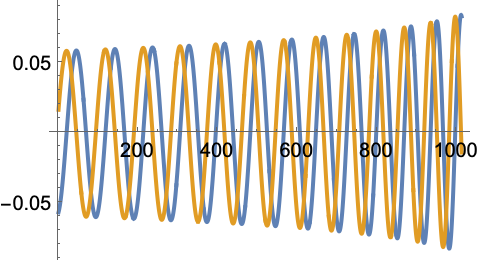
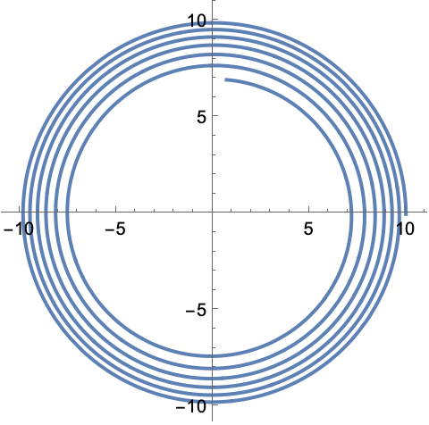



<p>
 <h1 style="display:inline">WaSABI</h1> <span style="float:right;"><a href="https://bhptoolkit.org/mathematica-install.html" class = "code_btn">Install this package!</a></span>
 <h2>Waveform Simulations of Asymmetric Binary Inspirals</h2>
</p>

A package to generate gravitational waveforms from SF theory and SF-PN Hybrids.

Currently 0PA spinning, 1PAT1 non-spinning, 1PA with slowly spinning primary and arbitrary secondary, quasicircular models are available as well as version 1.0 of the WaSABI-C hybrid model.

 <h2>Quick example</h2>
</p>

You can list the implemented models with:

```Mathematica
ListModels[]
```
```
{"0PAKerr", "0PASchwarz", "1PAT1ea", "1PAT1", "1PAT1R","WaSABI-C","WaSABI-C_v0.9"}
```

Say you want to generate a gravitational waveform for $\texttt{1PAT1}$. You can query the initial condition format that this model requires using:

```Mathematica
InitialConditions["1PAT1"]
```
```
<|"M" -> _, "r0" -> _, "\[Nu]" -> _, "\[Phi]" -> _|>
```

These initial conditions can be given to $\texttt{BinaryInspiral}[]$:
```Mathematica
inspiral = BinaryInspiral[<|"r0" -> 10, "M" -> 1, "\[Nu]" -> 1/10, "\[Phi]" -> 0|>, "Model" -> "1PAT1"];
````


You can then plot the gravitational waveform for the $\ell=2,m=2$ mode with:
```Mathematica
tmax = inspiral["Duration"];
Plot[Evaluate[ReIm[inspiral["Waveform"][2, 2][t]]], {t, 0, tmax}]
```
<p align="center"></p>

You can also plot the orbital trajectory:
```Mathematica
r0 = inspiral["Trajectory"]["r0"];
\[Phi] = inspiral["Trajectory"]["\[Phi]"];
ParametricPlot[{r0[t] Cos[\[Phi][t]], r0[t] Sin[\[Phi][t]]}, {t, 0, tmax}]
```
<p align="center"></p>

Let's say you like this model, and want to use it for your study. However, you know nothing about it. Then you probably first want to read how $\texttt{1PAT1}$ has been constructed. You can use $\texttt{CiteModel}[]$ to get the article in which the model has been developed:

```Mathematica
CiteModel["1PAT1"]
````
```
@article{Wardell:2021fyy,
    author = "Wardell, Barry and Pound, Adam and Warburton, Niels and Miller, Jeremy and Durkan, Leanne and Le Tiec, Alexandre",
    title = "{Gravitational Waveforms for Compact Binaries from Second-Order Self-Force Theory}",
    eprint = "2112.12265",
    archivePrefix = "arXiv",
    primaryClass = "gr-qc",
    doi = "10.1103/PhysRevLett.130.241402",
    journal = "Phys. Rev. Lett.",
    volume = "130",
    number = "24",
    pages = "241402",
    year = "2023"
}
```

Now that you know how $\texttt{1PAT1}$ is formulated, you want to compare it with another model. Maybe you don't want to compare the waveforms, nor the trajectories, but only the forcing terms. You can access the forcing terms of a model with:

```Mathematica
FT = ForcingTerms["1PAT1"]
```

This is a function on phase space, and it can be evaluated at a particular point on parameter space with:

```Mathematica
FT[<|"r0" -> 10, "\[Phi]" -> 0, "\[Nu]" -> 0.1, "M" -> 1|>]
```
```Mathematica
<|"d\[CapitalOmega]/dt" -> 7.86312*10^-6, "d\[Phi]/dt" -> 0.0316228, 
 "d\[Nu]/dt" -> 0., "dM/dt" -> 0.|>
```
You can plot for example the forcing term $d\Omega/dt$ as a function of the orbital separation $r_0$:
```Mathematica
Plot[FT[<|"r0" -> r, "\[Phi]" -> 0, "\[Nu]" -> 0.1, 
    "M" -> 1|>][["d\[CapitalOmega]/dt"]], {r, 20, 6.4}, 
 PlotRange -> All, GridLines -> Automatic, Frame -> True]
```
<p align="center"></p>


## Citing

[](https://doi.org/10.5281/zenodo.16358046)

In addition to acknowledging the Black Hole Perturbation Toolkit as suggested on the [front page](https://bhptoolkit.org) we also recommend citing the specific package version you use via the citation information on the package’s Zenodo page linked from the above DOI.

Please also make sure you cite the original authors of the models. You can retrieve that information using $\texttt{CiteModel[]}$.

For example, if you make use of the $\texttt{1PAT1}$, you should cite:
```Mathematica
CiteModel["1PAT1"]
````
```
@article{Wardell:2021fyy,
    author = "Wardell, Barry and Pound, Adam and Warburton, Niels and Miller, Jeremy and Durkan, Leanne and Le Tiec, Alexandre",
    title = "{Gravitational Waveforms for Compact Binaries from Second-Order Self-Force Theory}",
    eprint = "2112.12265",
    archivePrefix = "arXiv",
    primaryClass = "gr-qc",
    doi = "10.1103/PhysRevLett.130.241402",
    journal = "Phys. Rev. Lett.",
    volume = "130",
    number = "24",
    pages = "241402",
    year = "2023"
}
```


## Authors and contributors

Barry Wardell, Josh Mathews, Loïc Honet
